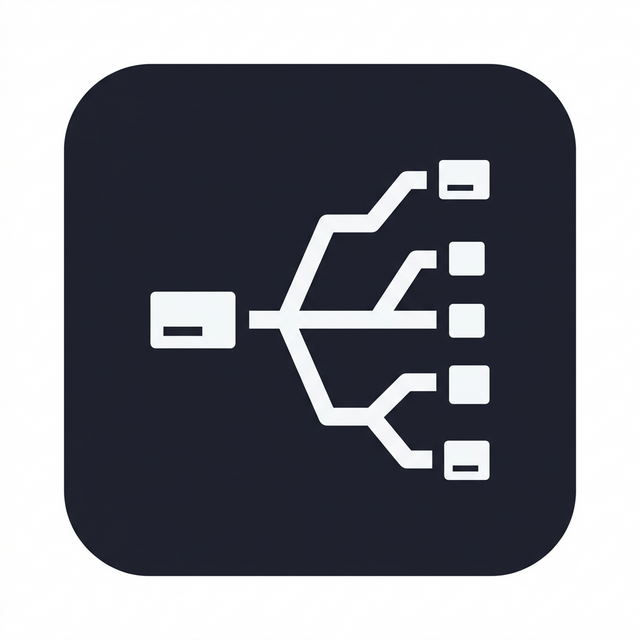

<p align="center">
  
</p>

<h1 align="center">Pylon</h1>

<p align="center">
  A native desktop client for Claude, built on the <a href="https://www.npmjs.com/package/@anthropic-ai/claude-agent-sdk">Claude Agent SDK</a>.<br/>
  Rich chat interface · tool visualization · git worktree isolation · PR reviews · multi-session tabs
</p>

<p align="center">
  
  
  
  
</p>

---

## Features

### Chat & Conversation

- **Agentic chat** — Full Claude Agent SDK integration with tool use, extended thinking, and subagent orchestration
- **Model selection** — Switch between Claude Opus 4.6, Sonnet 4.6, and Haiku 4.5
- **Real-time streaming** — Token streaming at 60 fps with delta batching via `requestAnimationFrame`
- **Extended thinking** — Expandable/collapsible thinking blocks showing Claude's reasoning
- **Subagent support** — Visual containers for multi-agent orchestration with threaded message history
- **Session persistence** — All sessions and messages stored in SQLite (WAL mode), resumable across app restarts
- **Cost tracking** — Real-time token usage and USD cost per session

### Tool Visualization

Rich, purpose-built renderers for every tool Claude can use:

| Tool | Rendering |
|------|-----------|
| **Bash** | Terminal-style output with ANSI color support |
| **Read** | File contents with syntax highlighting |
| **Edit** | Inline diff preview of changes |
| **Write** | New file creation with content display |
| **Glob / Grep** | File match results with paths |
| **TodoWrite** | Task items extracted into a sidebar panel with status tracking |
| **WebSearch** | Search results with clickable links |
| **AskUserQuestion** | Multi-select question dialogs with option descriptions |
| **Generic** | Fallback renderer for any other tool |

### Git & Worktree Isolation

- **Automatic worktrees** — Optionally run each session in an isolated git worktree (`~/.pylon/worktrees/`)
- **Dirty state detection** — Prompts to create a worktree when the repo has uncommitted changes
- **Branch management** — Auto-creates branches named `claude/{title-slug}`
- **Baseline diffing** — Captures git baseline on first Edit/Write to show only session changes
- **Merge & cleanup** — Dialog to merge worktree changes back or discard, with conflict detection

### File Change Tracking

- **Changes panel** — Visual list of all modified/added/deleted/renamed files with status badges (A/M/D/R/U)
- **Unified diffs** — View diffs for every file Claude has touched, computed against the session baseline
- **Attachments** — Drag-and-drop or paste images and text files into the chat with inline previews

### GitHub PR Reviews

- **PR browsing** — List and inspect pull requests from your GitHub repos via `gh` CLI
- **AI-powered reviews** — Multi-agent review system with specialized focus areas:
  - **Security** — Authentication, injection, secrets, crypto flaws
  - **Bugs** — Logic errors, null checks, state handling
  - **Performance** — N+1 queries, unnecessary renders, memory leaks
  - **Style** — Naming, formatting, consistency, duplication
  - **Architecture** — Design patterns, abstractions, separation of concerns
- **Findings UI** — Severity-filtered results (critical / warning / suggestion / nitpick) with file and line references
- **Split diff view** — Side-by-side diff display with inline finding annotations
- **Post to GitHub** — Post individual findings or batch-post as a full review
- **Custom prompts** — Edit each review agent's system prompt with reset-to-default

### Plan Detection & Review

- **Auto-detection** — Recognizes plan/design files (`*-plan.md`, `*-design.md`, `docs/plans/*`, `docs/specs/*`)
- **Hierarchical parsing** — Sections parsed into H2 parent / H3 children structure
- **Per-section comments** — Add comments to individual sections of a plan
- **Approval flow** — Approve plans or request changes through a dedicated dialog

### Tool Permissions

- **Ask mode** — Interactive modal for each tool call, showing tool name and input preview
- **Auto-approve mode** — "YOLO" mode that grants all permissions automatically
- **Pattern suggestions** — Suggested permission patterns when granting access

### UI & Navigation

- **Multi-session tabs** — Open parallel sessions with `Cmd+N`, switch with `Cmd+1..9`
- **Command palette** — Searchable quick-action menu (`Cmd+Shift+K`) with session commands, global commands, and recent sessions
- **Navigation rail** — Left sidebar with Home, History, PR Review, and Settings views
- **Settings overlay** — Tabbed settings for general config, review agents, and integrations (`Cmd+K`)
- **Dark theme** — Purpose-built dark interface
- **Animated transitions** — Smooth motion effects via Framer Motion

### Usage Analytics

- **Spending dashboard** — Daily cost trends (area chart), token usage by day, cost breakdown by model and project
- **Top sessions** — 10 most expensive sessions at a glance
- **Time filters** — 7-day, 30-day, 90-day, and all-time views

### Keyboard Shortcuts

| Shortcut | Action |
|----------|--------|
| `Cmd+N` | New tab |
| `Cmd+1..9` | Switch to tab by index |
| `Cmd+Shift+K` | Command palette |
| `Cmd+K` | Settings |
| `Escape` | Close modal / palette |

---

## Prerequisites

- [Bun](https://bun.sh) v1.1+
- A valid [Claude Code](https://claude.ai/code) login (the app uses your existing Claude Code authentication)
- [GitHub CLI](https://cli.github.com/) (`gh`) — optional, required for PR review features

## Getting Started

```bash
# Install dependencies
bun install

# Start in development mode (with HMR)
bun run dev
```

## Scripts

| Command | Description |
|---------|-------------|
| `bun run dev` | Start Electron dev server with HMR |
| `bun run build` | Production build |
| `bun run start` | Preview production build |
| `bun run typecheck` | Typecheck main + renderer |
| `bun run typecheck:node` | Typecheck main/preload only |
| `bun run typecheck:web` | Typecheck renderer only |

## Architecture

```
src/
├── main/                 # Electron main process
│   ├── index.ts              # App bootstrap, window creation, DB init
│   ├── session-manager.ts    # Session lifecycle, SDK orchestration, git ops
│   ├── ipc-handlers.ts       # ~20 IPC channel registrations
│   └── db.ts                 # SQLite schema (WAL mode) & migrations
├── preload/              # Context bridge (window.api)
│   ├── index.ts
│   └── index.d.ts
├── renderer/src/         # React frontend
│   ├── App.tsx               # Route dispatch, keyboard shortcuts, IPC bridge
│   ├── pages/                # HomePage, SessionView
│   ├── store/                # Zustand stores (session, tab, ui, pr-review)
│   ├── hooks/                # IPC bridge, folder picker, Shiki loader
│   ├── lib/                  # Delta batcher, task extraction, ANSI parser
│   └── components/
│       ├── messages/         # Chat bubbles, thinking, permissions, subagents
│       ├── tools/            # Tool-specific renderers (Bash, Edit, etc.)
│       └── layout/           # Shell, NavRail, TabBar
└── shared/               # Types & IPC channel constants
```

**Key data flow:** Renderer invokes `window.api.*()` → `ipcMain.handle()` → SessionManager calls Claude Agent SDK → messages stream back via IPC → delta batcher flushes to Zustand at 60 fps → React renders.

## Tech Stack

- **Runtime:** [Electron 39](https://www.electronjs.org/) + [electron-vite](https://electron-vite.org/)
- **Frontend:** [React 19](https://react.dev/), [Tailwind CSS 4](https://tailwindcss.com/), [Zustand](https://zustand.docs.pmnd.rs/)
- **Routing:** [Wouter](https://github.com/molefrog/wouter)
- **Database:** [better-sqlite3](https://github.com/WiseLibs/better-sqlite3) (WAL mode)
- **AI:** [@anthropic-ai/claude-agent-sdk](https://www.npmjs.com/package/@anthropic-ai/claude-agent-sdk)
- **Charts:** [Recharts](https://recharts.org/)
- **Animations:** [Framer Motion](https://www.framer.com/motion/)
- **Syntax Highlighting:** [Shiki](https://shiki.style/)
- **Markdown:** [react-markdown](https://github.com/remarkjs/react-markdown) + [remark-gfm](https://github.com/remarkjs/remark-gfm)
- **Icons:** [Lucide React](https://lucide.dev/)

## License

Private — not yet published.
