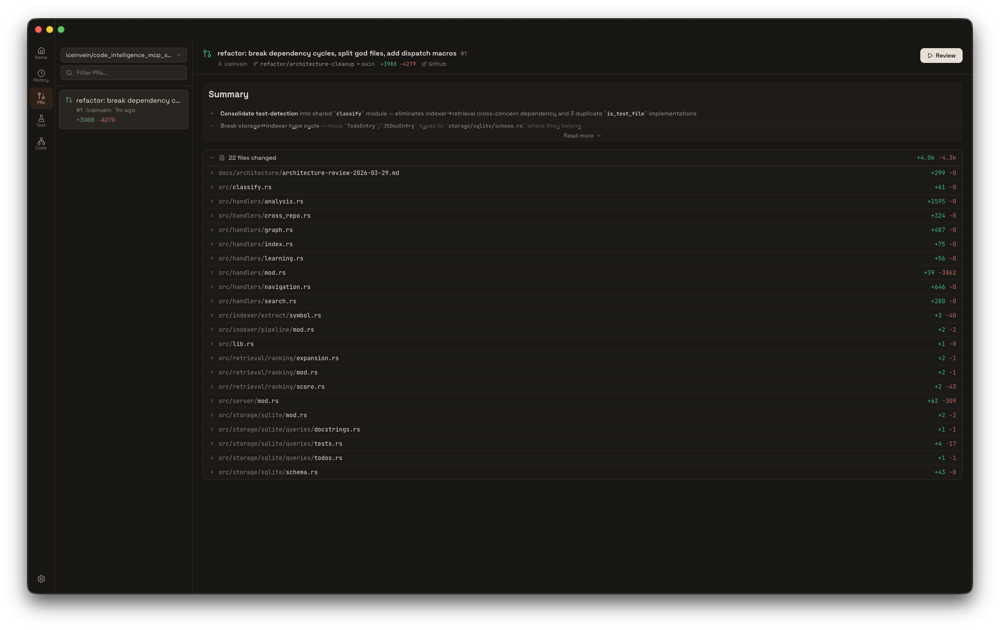

<p align="center">
  
</p>

<h1 align="center">Pylon</h1>

<p align="center">
  <strong>A native desktop client for AI-assisted development — built for deep work, not chat windows.</strong><br/>
  Supports the <a href="https://www.npmjs.com/package/@anthropic-ai/claude-agent-sdk">Claude Agent SDK</a> and <a href="https://www.npmjs.com/package/@openai/codex-sdk">OpenAI Codex SDK</a>.
</p>

<p align="center">
  
  
  
  
</p>

---

<p align="center">
  
</p>

## Why Pylon

Most AI interfaces are web apps in a frame. Pylon is a desktop application — purpose-built for the way developers actually work. Multi-session tabs. Git worktrees that isolate each task. PR reviews that run in parallel. Every tool call rendered with intention, not dumped as JSON.

It connects directly to your Claude Code authentication. No extra accounts. No browser tabs. Just open it and work.

---

## Sessions

Full agent SDK integration with real-time token streaming, extended thinking, and multi-agent orchestration. Switch between Claude (Opus, Sonnet, Haiku) and Codex models. Adjust reasoning effort per session. Resume any conversation where you left off — sessions persist in a local SQLite database.

**Plan mode** lets you review what the agent intends to do before it executes. The agent proposes a plan, you approve or revise, then it proceeds. Read-only until you say go.

Every tool the agent uses gets a purpose-built renderer. Bash output renders with ANSI colors. Edits show inline diffs. File reads display syntax-highlighted code. `TodoWrite` tasks extract into a sidebar panel you can track. Nothing is hidden behind "raw output" toggles.

A context window indicator shows exactly where you stand. Cost tracking keeps you informed. Every session is a tab, and every tab remembers its draft.

---

## PRs

### Review

<p align="center">
  
</p>

Select a pull request from your repo. Pylon dispatches specialized review agents in parallel — security, bugs, performance, style, architecture, UX — each with its own system prompt you can customize.

Large diffs are automatically chunked for parallel processing. Findings surface with severity badges and precise file/line references. Review them in a split diff view with inline annotations, then post individual findings or a full review directly to GitHub.

### Creation

Raise pull requests without leaving the app. The agent analyzes your commits and diffs to draft the title and body. Review the included changes, set your base branch, and submit.

---

## Testing

Point Pylon at your project and it auto-detects your framework, dev command, and port. The agent suggests exploration goals, then dispatches workers to navigate your running app and find bugs.

Findings come back with severity grades and reproduction steps. A monitoring view shows live agent activity. A comparison view lets you review findings across multiple exploration runs.

---

## Code

An AST-powered code explorer for your project. The repo map gives a high-level structural overview. Select any file to visualize its syntax tree, with a code panel and minimap for navigation. An AI chat panel lets you ask questions about the code structure.

---

## Everywhere

### Git

A full git panel lives in the navigation rail. Canvas-rendered commit graph with branch coloring and interactive selection. AI-generated commit messages from staged changes. Natural language git operations — type a command in plain English and Pylon translates, confirms, executes.

When conflicts arise, an AI resolver walks through each file with confidence badges.

### Worktree Isolation

Each session can run in its own git worktree. Pylon captures a baseline on the first edit, so diffs show only what changed in *this* session. Setup recipes let you configure how worktrees are initialized. When you're done, merge back or discard — all from a single dialog.

### Usage Analytics

A spending dashboard tracks daily cost trends, token usage by model and project, and your most expensive sessions. Filter by 7, 30, or 90 days.

### Command Palette & Keyboard Shortcuts

Cmd+K opens the command palette for every action. Full keyboard shortcut system for navigation, session management, and mode switching — with a searchable overlay to discover them.

---

## Getting Started

### Install

Download the latest `.dmg` from [**GitHub Releases**](https://github.com/iceinvein/pylon/releases). macOS universal binary (Apple Silicon + Intel), signed and notarized.

### Build from Source

**Prerequisites**
- [Bun](https://bun.sh) v1.1+
- A [Claude Code](https://claude.ai/code) login
- [GitHub CLI](https://cli.github.com/) (`gh`) — optional, for PR features

```bash
bun install
bun run dev
```

Pylon uses your existing Claude Code authentication.

---

## Architecture

Pylon is an [electron-vite](https://electron-vite.org/) project with three processes:

- **Main** — Electron + provider abstraction (Claude Agent SDK, Codex SDK) + SQLite persistence
- **Preload** — Typed IPC bridge via `contextBridge.exposeInMainWorld`
- **Renderer** — React + Zustand + Tailwind CSS

Both AI SDKs are normalized into a common event stream through a provider abstraction layer. The session manager is provider-agnostic — it doesn't care which SDK is underneath.

<details>
<summary><strong>Tech stack</strong></summary>

<br/>

| Layer | Technology |
|-------|------------|
| Runtime | [Electron 39](https://www.electronjs.org/) + [electron-vite](https://electron-vite.org/) |
| Frontend | [React 19](https://react.dev/), [Tailwind CSS 4](https://tailwindcss.com/), [Zustand](https://zustand.docs.pmnd.rs/) |
| Routing | [Wouter](https://github.com/molefrog/wouter) |
| Database | [better-sqlite3](https://github.com/WiseLibs/better-sqlite3) (WAL mode) |
| AI (Claude) | [@anthropic-ai/claude-agent-sdk](https://www.npmjs.com/package/@anthropic-ai/claude-agent-sdk) |
| AI (Codex) | [@openai/codex-sdk](https://www.npmjs.com/package/@openai/codex-sdk) |
| Code Analysis | [web-tree-sitter](https://github.com/nicolo-ribaudo/tree-sitter-wasm) + [tree-sitter-wasms](https://github.com/nicolo-ribaudo/tree-sitter-wasm) |
| Visualization | [d3-force](https://d3js.org/d3-force) |
| Charts | [Recharts](https://recharts.org/) |
| Animations | [Motion](https://motion.dev/) |
| Syntax | [Shiki](https://shiki.style/) |
| Markdown | [react-markdown](https://github.com/remarkjs/react-markdown) + [remark-gfm](https://github.com/remarkjs/remark-gfm) |
| Icons | [Lucide React](https://lucide.dev/) |
| Linting | [Biome](https://biomejs.dev/) |

</details>

---

## License

[MIT](LICENSE)
