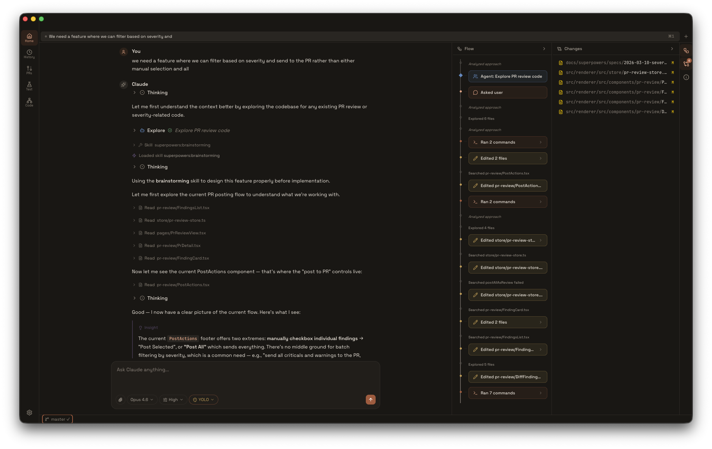

<p align="center">
  
</p>

<h1 align="center">Pylon</h1>

<p align="center">
  <strong>A native desktop client for Claude that feels like an instrument, not a chat window.</strong><br/>
  Built on the <a href="https://www.npmjs.com/package/@anthropic-ai/claude-agent-sdk">Claude Agent SDK</a>. Designed for deep work.
</p>

<p align="center">
  
  
  
  
</p>

---

<p align="center">
  
</p>

## Why Pylon

Most AI interfaces are web apps in a frame. Pylon is a desktop application — purpose-built for the way developers actually work. Multi-session tabs. Git worktrees that isolate each task. PR reviews that run in parallel. Every tool call rendered with intention, not dumped as JSON.

It connects directly to your Claude Code authentication. No extra accounts. No browser tabs. Just open it and work.

---

## Chat

<!-- screenshot: chat view with streaming response and tool calls visible -->

Full Claude Agent SDK integration with real-time token streaming, extended thinking, and multi-agent orchestration. Switch between Opus, Sonnet, and Haiku. Adjust reasoning effort per session. Resume any conversation where you left off — sessions persist in a local SQLite database.

A context window indicator shows exactly where you stand. Cost tracking keeps you informed. Every session is a tab, and every tab remembers its draft.

---

## Tool Visualization

<!-- screenshot: mix of tool renderers — Bash terminal output, Edit diff, TodoWrite panel -->

Every tool Claude uses gets a purpose-built renderer. Bash output renders with ANSI colors. Edits show inline diffs. File reads display syntax-highlighted code. `TodoWrite` tasks extract into a sidebar panel you can track. Nothing is hidden behind "raw output" toggles.

---

## Git

<!-- screenshot: git panel showing commit graph + AI commit dialog -->

A full git panel lives in the navigation rail. Canvas-rendered commit graph with branch coloring and interactive selection. AI-generated commit messages from staged changes. Natural language git operations — type "rebase onto main" and Pylon translates, confirms, executes.

When conflicts arise, an AI resolver walks through each file with confidence badges.

**Worktree isolation** — Each session can run in its own git worktree. Pylon captures a baseline on the first edit, so diffs show only what changed in *this* session. When you're done, merge back or discard — all from a single dialog.

---

## PR Reviews

<!-- screenshot: PR review view with split diff and finding annotations -->

Select a pull request from your repo. Pylon dispatches specialized review agents in parallel — security, bugs, performance, style, architecture, UX — each with its own system prompt you can customize.

Large diffs are automatically chunked for parallel processing. Findings surface with severity badges and precise file/line references. Review them in a split diff view with inline annotations, then post individual findings or a full review directly to GitHub.

---

## PR Creation

<!-- screenshot: PR creation overlay with AI-generated description -->

Raise pull requests without leaving the app. Claude analyzes your commits and diffs to draft the title and body. Review the included changes, set your base branch, and submit.

---

## AI Exploration Testing

<!-- screenshot: test view with findings dashboard and severity breakdown -->

Point Pylon at your project and it auto-detects your framework, dev command, and port. Claude suggests exploration goals, then dispatches agents to navigate your running app and find bugs.

Findings come back with severity grades, reproduction steps, and screenshots. Agents generate Playwright test files you can add directly to your suite. Run multiple explorations in parallel across different goals.

---

## Usage Analytics

<!-- screenshot: spending dashboard with area chart and model breakdown -->

A spending dashboard tracks daily cost trends, token usage by model and project, and your most expensive sessions. Filter by 7, 30, or 90 days.

---

## Getting Started

**Prerequisites**
- [Bun](https://bun.sh) v1.1+
- A [Claude Code](https://claude.ai/code) login
- [GitHub CLI](https://cli.github.com/) (`gh`) — optional, for PR features

```bash
bun install
bun run dev
```

That's it. Pylon uses your existing Claude Code authentication.

---

## Architecture & Contributing

Pylon is an [electron-vite](https://electron-vite.org/) project with three processes: main (Electron + Claude Agent SDK + SQLite), preload (typed IPC bridge), and renderer (React + Zustand + Tailwind).

For the full architecture breakdown, build scripts, and contribution guide, see [**docs/CONTRIBUTING.md**](docs/CONTRIBUTING.md).

<details>
<summary><strong>Tech stack</strong></summary>

<br/>

| Layer | Technology |
|-------|------------|
| Runtime | [Electron 39](https://www.electronjs.org/) + [electron-vite](https://electron-vite.org/) |
| Frontend | [React 19](https://react.dev/), [Tailwind CSS 4](https://tailwindcss.com/), [Zustand](https://zustand.docs.pmnd.rs/) |
| Routing | [Wouter](https://github.com/molefrog/wouter) |
| Database | [better-sqlite3](https://github.com/WiseLibs/better-sqlite3) (WAL mode) |
| AI | [@anthropic-ai/claude-agent-sdk](https://www.npmjs.com/package/@anthropic-ai/claude-agent-sdk) |
| Charts | [Recharts](https://recharts.org/) |
| Animations | [Motion](https://motion.dev/) |
| Syntax | [Shiki](https://shiki.style/) |
| Markdown | [react-markdown](https://github.com/remarkjs/react-markdown) + [remark-gfm](https://github.com/remarkjs/remark-gfm) |
| Icons | [Lucide React](https://lucide.dev/) |
| Linting | [Biome](https://biomejs.dev/) |

</details>

---

<p align="center">
  <em>Private — not yet published.</em>
</p>
